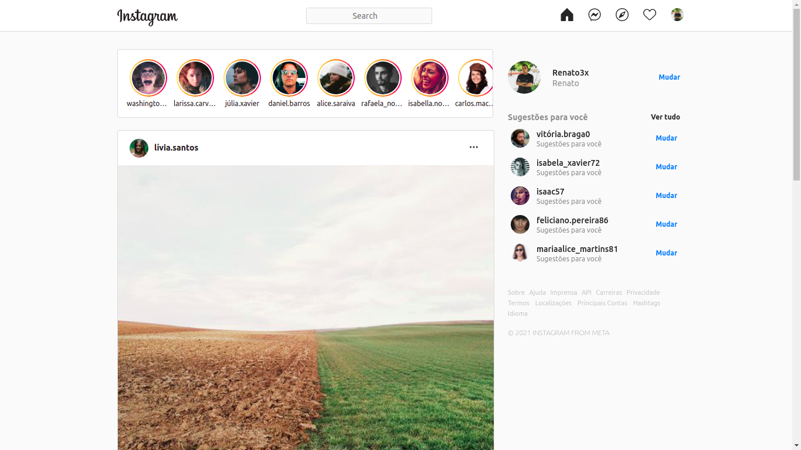

# Devgram 📷

Clone of the instagram homepage made in Angular

This application created with Angular is intended to put my knowledge of this technology into practice by making a clone of one of the biggest social networks today: Instagram.

This App, each time the page loads, generates a different amount of different posts and different users. This mechanic is done using the **Faker** library.

## App



## Setup

Install all packages:

``` Javascript
npm i
```

or:

``` Javascript
yarn add
```

Start app

```Javascript
ng serve
```
